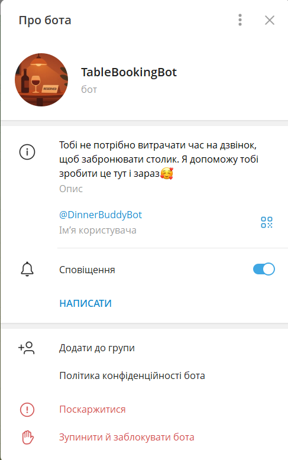
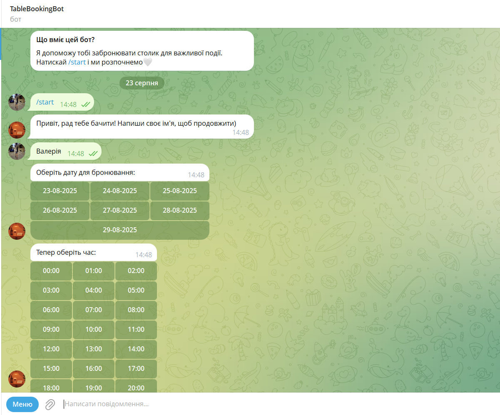
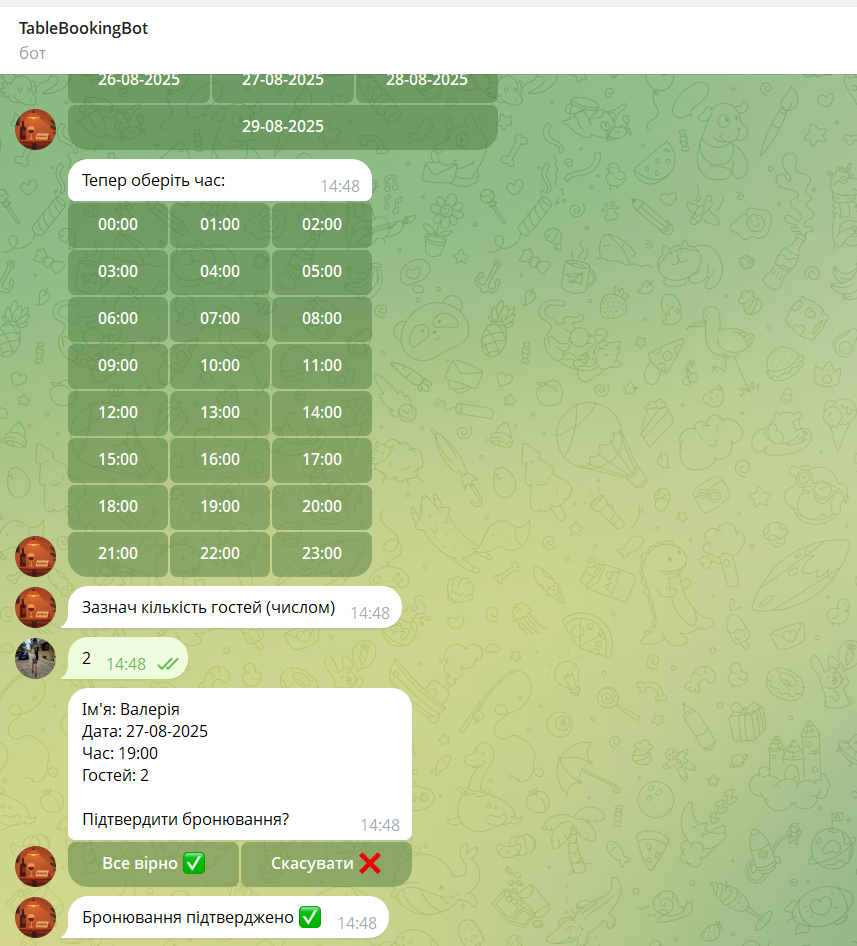
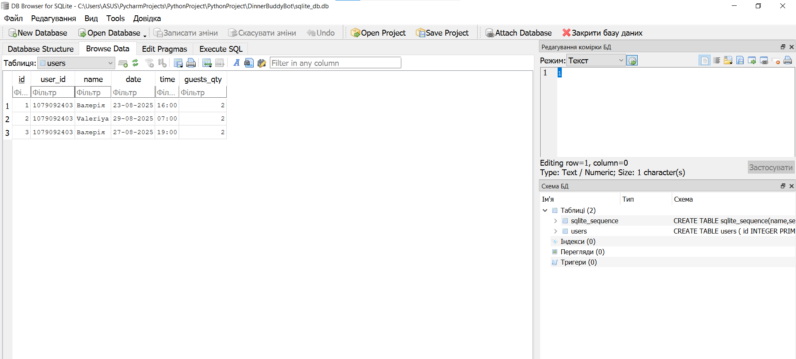

# Dinner Bot :wine_glass:

Простий телеграм бот для бронювання столику в закладі.
Усі дані, введені користувачем, зберігаються у базі SQLite.


## Description :notebook:

Цей телеграм бот збирає необхідну інформацію для бронювання від користувача. 
Бот запитує ім'я, пропонує можливі дати та час, уточнює питання щодо кількості гостей.
Коли збирається вся необхідна інформація, то користувач бачить перед собою узагальнююче повідомлення, після якого має підтвердити або скасувати броню. 
Якщо наступним кроком йде підтвердження, то введені дані зберігаються до бази даних SQLite.

Телеграм бот даного формату допомагає користувачу спростити процес бронювання столика в ресторані без телефонного виклику адміністатору закладу, не залежачи від графіку працівників.


## Functional :wrench:

1. **Старт роботи, привітання з користувачем**
     Бот розпочинає роботу після натискання */start*, вітається та питає ім'я користувача.
2. **Вибір дати бронювання**
     Після того, як користувач вводить своє ім'я, бот сам пропонує дати на найближчі 7 днів, починаючи від сьогодні, у вигляді кнопок.
3. **Вибір часу бронювання**
     Проходить по аналогії до вибору часу.
4. **Зазначення кількості гостей**
     Корисувач самостійно вводить кількість гостей числом.
5. **Підтвердження бронювання**
     Якщо всі вище зазначені пункти зазначені, бот відправляє узагальнене повідомлення з деталями. Користувач може підтвердити або скасувати бронювання, натиснувши на необхідні кнопки.
6. **Збереження до бази даних**
     Якщо користувач підтверджує бронювання, його дані зберігаються у базі даних, для подальшого використання їх адміністрацією закладу.

***Вибір дати та часу реалізовно через кнопки, що спрощує взаємодію користувача з ботом***


## Usage :bulb:

1. Відкрити бота у Telegram і натиснути /start.
2. Ввести своє ім’я.
3. Обрати дату та час.
4. Ввести кількість гостей.
5. Підтвердити або скасувати бронювання.


## Tech Stack :hammer:
+ Python 3.12
+ Telegram Bot API
+ SQLite


## The structure of the project :clipboard:

***dinner_bot***
1. **main.py**           Файл, який є ключовою частиною проекта,запускає бот
2. **config.py**         Цей файл містить токен та всі необхідні константи
3. ***handlers/***       Папка, яка містить у собі всю логіку кода:
     - *__init__.py*     Файл для того, щоб папка вважалась модудем
     - *start.py*        Бот розпочинає роботу із функції /start та питає ім'я користувача
     - *booking.py*      Відбувається вибір дати та часу, користувач зазначає кількість гостей
     - *confirm.py*      Підтвердження бронювання
4. ***utils/***          Створення кнопок та збереження даних до бази SQLite:
     - *__init__.py*     Файл для того, щоб папка вважалась модудем
     - *keyboards.py*    Створення клавіатур
     - *storage.py*      Робота з пам'яттю та збереження до бази даних


## Installing dependencies

*Перед запуском бота потрібно встановити необхідні бібліотеки.  
Для цього виконай у терміналі:*

```bash
pip install -r requirements.txt
```

## An example of bot work




