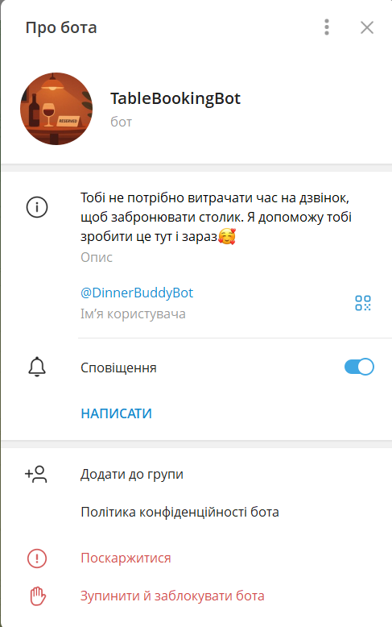
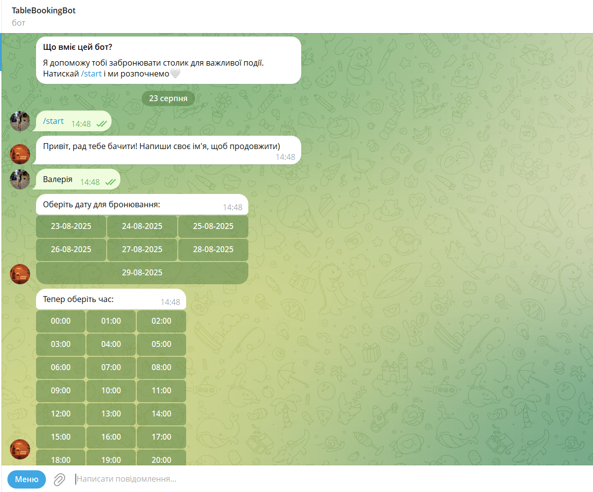

# Dinner Bot :wine_glass:

A simple Telegram bot for booking a table at a restaurant.
All data entered by the user is stored in a SQLite database.

## Description :notebook:

This Telegram bot collects the necessary information for a reservation from the user.
The bot asks for a name, suggests possible dates and times, and clarifies the question about the number of guests.
When all the necessary information is collected, the user sees a summary message, after which they must confirm or cancel the reservation.
If the next step is confirmation, the entered data is saved to the SQLite database.

A Telegram bot of this format helps the user simplify the process of booking a table in a restaurant without calling the administrator of the establishment, without depending on the schedule of employees.

## Functional :wrench:

1. **Start of work, greeting the user**
The bot starts working after pressing */start*, greets and asks for the user's name.
2. **Selecting the booking date**
After the user enters their name, the bot itself suggests dates for the next 7 days, starting from today, in the form of buttons.
3. **Selecting the booking time**
This works similarly to selecting the date.
4. **Specifying the number of guests**
The user independently enters the number of guests in numbers.
5. **Confirming the booking**
If all of the above points are specified, the bot sends a summary message with the booking details. The user can confirm or cancel the booking by clicking on the necessary buttons.
6. **Saving to the database**
If the user confirms the booking, his data is stored in the database for further use by the institution's administration.

***Selecting the date and time is implemented through buttons, which simplifies the user's interaction with the bot***

## Usage :bulb:

1. Open the bot in Telegram and press the /start command.
2. Enter your name.
3. Select a date and time.
4. Enter the number of guests.
5. Confirm or cancel the reservation.

## Tech Stack :hammer:
+ Python 3.12
+ Telegram Bot API
+ SQLite

## The structure of the project :clipboard:

***dinner_bot***
1. **main.py** The file that is the key part of the project, starts the bot
2. **config.py** This file contains the token and all the necessary constants
3. ***handlers/*** The folder that contains all the code logic:
- *__init__.py* Marks the folder as a module
- *start.py* The bot starts working with the /start function and asks for the username
- *booking.py* The date and time are selected, the user indicates the number of guests
- *confirm.py* Confirmation of the reservation
4. ***utils/*** Creating buttons and saving data to the SQLite database:
- *__init__.py* The file to make the folder considered a module
- *keyboards.py* Creating keyboards
- *storage.py* Working with memory and saving to the database


## Installing dependencies

*Before running the bot, you need to install the required libraries.
To do this, run in the terminal:*

```bash
pip install -r requirements.txt
```


## An example of bot work




